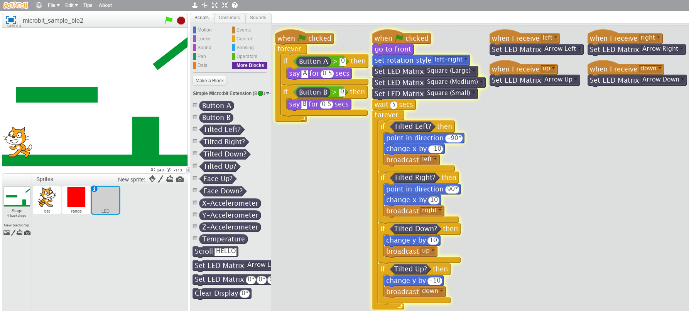

# scratch2-microbit (with BLE)
Scratch2 - Micro:bit extension (with BLE)

### 1. Create your own Scratch2 extension
* Install requirements

    `# pip install blockext==0.2.0a2`

    `# pip install pyserial`

* `microbit_ext.py` (using [blockext](https://github.com/blockext/blockext))

    `# python microbit_ext.py`

### 2. Import extension
* Import `microbit.s2e` extension, create your Scratch2 project (sample project `microbit_sample.sb2`).

* [使用 Micro:bit 控制 Scratch 2](https://www.youtube.com/watch?v=LmRsx7XCMOM)

### 3. Reference
- [Scratch Extension](https://wiki.scratch.mit.edu/wiki/Scratch_Extension)
- [Creating Scratch 2.0 Extensions](https://wiki.scratch.mit.edu/w/images/ExtensionsDoc.HTTP-9-11.pdf)
- [micro:bit game controller with Scratch](https://www.raspberrypi.org/learning/microbit-game-controller/)
- [How to read the micro:bit's serial output from your computer](https://www.microbit.co.uk/td/serial-library)

### 4. BLE (Bluetooth Low Energy)

* [Scratch controller with Micro:bit over BLE (Bluetooth Low Energy)](https://youtu.be/VrInYbzWn1I)
* [Scratch controller with Micro:bit over BLE (Bluetooth Low Energy)](https://youtu.be/DNTm0LNZBUU)
* [Scratch controller with Micro:bit over BLE (Bluetooth Low Energy)](https://youtu.be/kHZFJNNkeDY)

```
$ modprobe -r btusb
$ modprobe btusb
$ sudo rfkill unblock all

$ wget https://github.com/sandeepmistry/node-bbc-microbit/raw/master/firmware/node-bbc-microbit-v0.1.0.hex
$ cp node-bbc-microbit-v0.1.0.hex /run/media/lyshie/MICROBIT
$ pip install --user --upgrade "pygatt==3.1.1"
$ pip install --user --upgrade "pygatt[GATTTOOL]"
$ sudo python ./microbit_ext_ble.py D6:AF:43:58:57:9F
```

### 5. Author
HSIEH, Li-Yi
